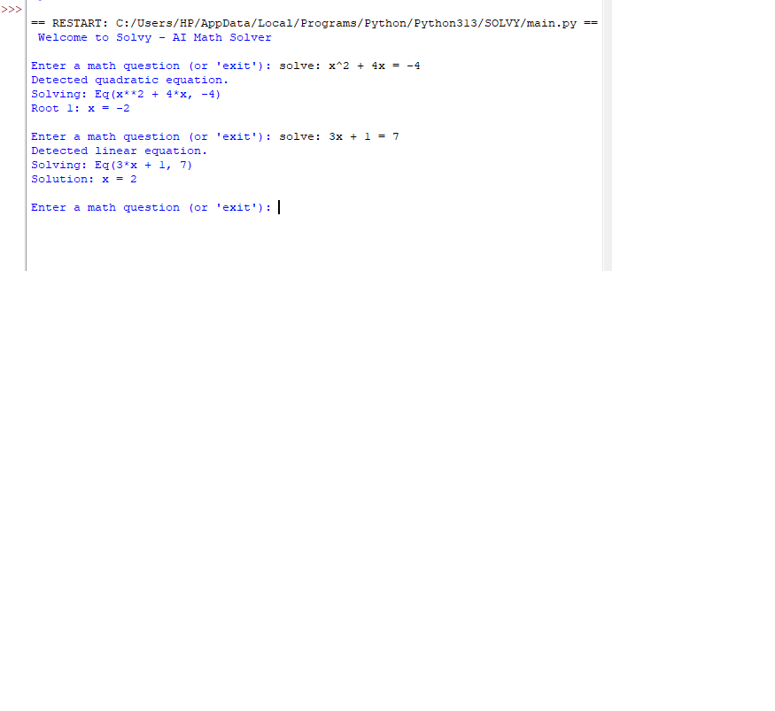

# Solvy – AI-Powered Math Solver

**Solvy** is a Python-based AI tutor that provides **solutions** to arithmetic, algebra, and linear equation problems. Built as a learning assistant, Solvy helps users understand the reasoning behind each step — making it a great educational tool for school-level math learners.

This is my one of my major AI project, and it reflects my goal of combining **artificial intelligence** with **accessible education**.

---

## Features

-  Solves linear equations (e.g. `3x + 5 = 17`)
-  Step-by-step reasoning for each solution
-  Supports basic arithmetic, algebra, and simplification
-  Custom logic engine using Python + SymPy
-  Modular code and clean interface
-  Future-ready design (GUI, voice, feedback, difficulty levels)

---

##  Tech Stack

- Python 3.10+
- SymPy (for symbolic math)
- Custom logic parser
- Optional: Tkinter or Flask (for future interface)

---

##  Demo Screenshot

